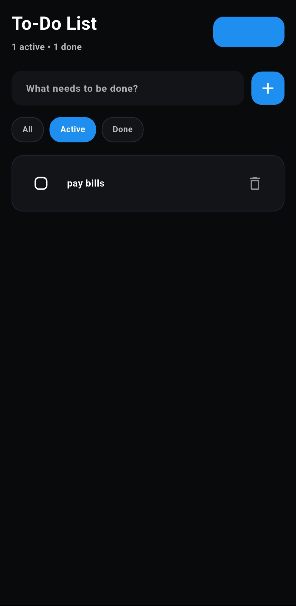
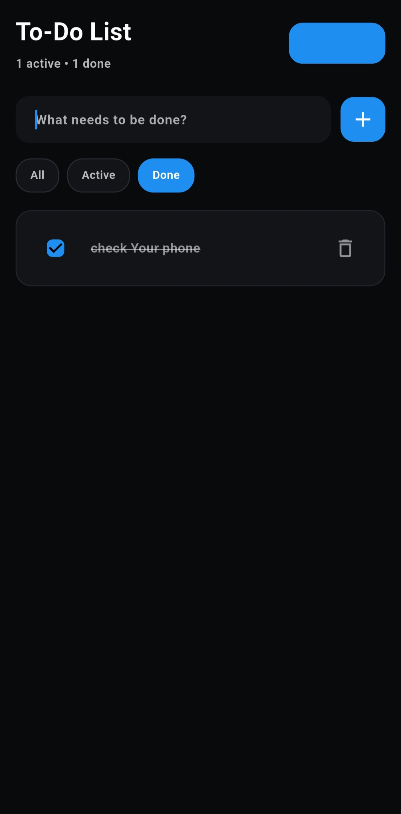

# TODOAPP

A Flutter task manager app with local storage using Hive and a clean architecture code structure.

## Overview

This app manages a simple to-do list with:
- Add new tasks
- Toggle task status between done and not done
- Delete tasks
- Filter tasks by All / Active / Done
- Store data locally in Hive
- Dark theme with a black UI

## Architecture

The project is organized into clear layers:

- `lib/core/` - Hive initialization and core services
- `lib/data/` - data models and data access implementation
- `lib/domain/` - entities, repository interfaces, and use cases
- `lib/presentation/` - UI screens and reusable widgets

## Main Files

- `lib/main.dart`
  - App entry point
  - Initialize Hive
  - Create use cases and connect the main screen

- `lib/core/hive_service.dart`
  - Initialize Hive and open the `tasks_box`

- `lib/data/models/task_model.dart`
  - Task model with conversion to/from the domain entity

- `lib/data/repositories/task_repository_impl.dart`
  - `TaskRepository` implementation using Hive

- `lib/domain/entities/task.dart`
  - Defines the `Task` entity and task filtering

- `lib/domain/usecases/task_use_cases.dart`
  - Core task management operations

- `lib/presentation/screens/todo_screen.dart`
  - Main task screen
  - Loads tasks from Hive and displays updates

- `lib/presentation/widgets/`
  - Reusable widgets such as `TaskInput`, `FilterBar`, and `TaskItem`

## 📸 Screenshots

  
  
  

